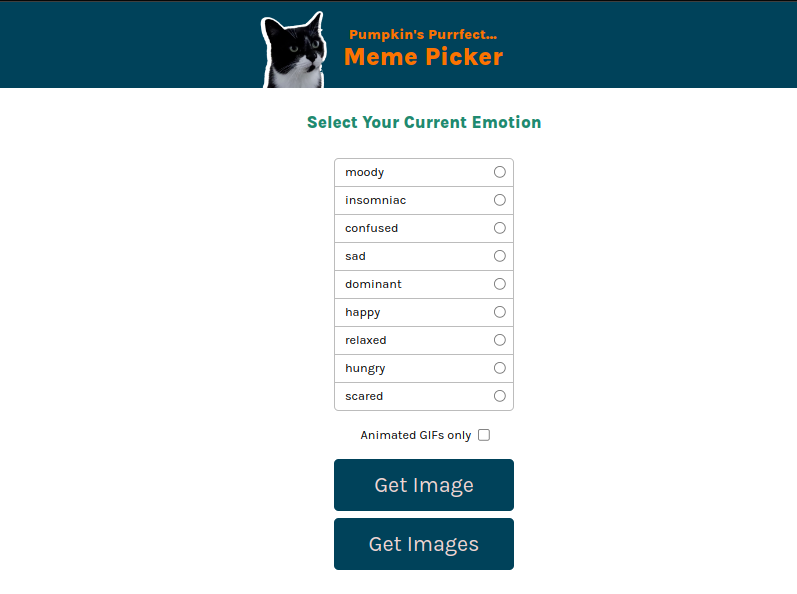

# Meme Picker

## Screenshot

## Main features:
1. Render a list of cat emotions.

2. When the user clicks and selects an emote, show the corresponding image or gif.

## Stretch goals:
1. Click outside the modal to close the modal.

2. Display more than one result (thumbnails in a gallery)
